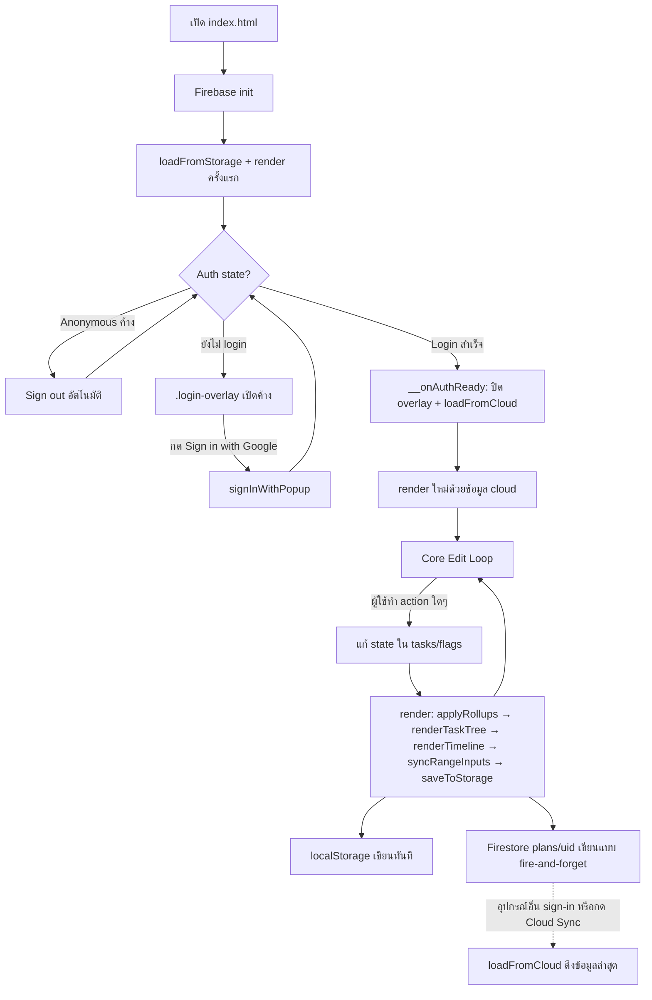

# WORKFLOW — ลำดับการทำงานของ Maintenance Project Planner

เอกสารนี้อธิบาย **ลำดับขั้นตอนการทำงาน** ของแอป ทั้งฝั่งผู้ใช้ (user flow) และเบื้องหลังระบบ (data/sync flow)
เป็นเอกสารคู่กับ [`SPEC.md`](./SPEC.md) ที่เป็นข้อมูลอ้างอิงโครงสร้าง/ฟีเจอร์/data model แบบแยกหมวด — ถ้า
SPEC.md บอกว่า "มีอะไรบ้าง" เอกสารนี้จะบอกว่า **"มันทำงานเป็นลำดับขั้นตอนอย่างไร"**

## 1. Boot / Startup Flow (ลำดับตอนเปิดเว็บ)

1. เบราว์เซอร์โหลด `index.html` → บล็อก `<script type="module">` ใน `<head>` รัน `initializeApp()`,
   `getAuth()`, `getFirestore()` ของ Firebase ก่อนเป็นอันดับแรก
2. สคริปต์หลักท้ายไฟล์รัน (ดูส่วน `// --- INIT ---`):
   ```
   loadFromStorage();       // อ่าน localStorage (v6, fallback v5) → applyLoadedPayload()
   updateToggleBtnStyles(); // sync สถานะปุ่ม CP/S-Curve ให้ตรงกับข้อมูลที่โหลดมา
   render();                // วาดหน้าจอครั้งแรกจากข้อมูล local ทันที ไม่ต้องรอ auth
   ```
3. `.login-overlay` เปิดค้างไว้เป็นค่าเริ่มต้น (class `open`) — ผู้ใช้เห็นข้อมูล local แว้บหนึ่งใต้ overlay
   แต่ยังใช้งานจริงไม่ได้จนกว่าจะ sign-in
4. ขนานกันไป Firebase `onAuthStateChanged` ทำงานเมื่อรู้ผล auth state:
   - ถ้าเจอ session แบบ **anonymous** ตกค้าง (จากเวอร์ชันเก่าก่อนสลับมาใช้ Google Sign-In) → สั่ง `signOut()`
     ทันที แล้ว state จะกลับไปที่ "signed-out" ต่อ (กัน user บายพาสด่าน login โดยไม่ตั้งใจ)
   - ถ้ายังไม่ล็อกอิน → คง overlay ไว้ รอผู้ใช้กดปุ่ม Sign in
   - ถ้าล็อกอินสำเร็จ → เรียก `window.__onAuthReady(user)` (รายละเอียดข้อ 3)
5. เมื่อ auth ready และดึงข้อมูล cloud มา apply เสร็จ แอปพร้อมใช้งานเต็มรูปแบบ

## 2. Authentication Flow

**Sign-in**
```
ผู้ใช้กด "Sign in with Google"
  → window.__fbSignIn()  (status = 'connecting')
  → เปิด Google Sign-In popup
  → สำเร็จ → Firebase trigger onAuthStateChanged
      → window.__onAuthReady(user)
          → ปิด .login-overlay (ลบ class 'open')
          → แสดงชื่อ/อีเมลผู้ใช้ในเมนู drawer
          → await loadFromCloud()   ← ดึงข้อมูลจาก Firestore มาทับ state
          → ถ้าได้ข้อมูลจาก cloud จริง → render() ใหม่อีกครั้ง
```
**ล้มเหลว**: popup ปิดเอง/provider error → `window.__onAuthError(err)` → แสดงข้อความ error ใต้ปุ่ม sign-in
พร้อม error code จาก Firebase

**Sign-out**: กดเมนู "Sign out" ใน drawer → `window.__fbSignOut()` → `onAuthStateChanged` trigger →
`window.__onSignedOut()` → เปิด `.login-overlay` กลับมา, เคลียร์ข้อความชื่อผู้ใช้

## 3. Core Edit Loop — วงจรหลักที่ทุกฟีเจอร์ใช้ร่วมกัน

ไม่ว่าผู้ใช้จะทำ action อะไร (เพิ่ม/ลบ/ลาก/แก้ task, toggle Critical Path หรือ S-Curve, เปลี่ยน zoom, เพิ่ม
dependency ฯลฯ) ทุกอย่างจะไหลผ่านวงจรเดียวกันนี้เสมอ:

```
ผู้ใช้ทำ action
  → แก้ state ใน array `tasks` (หรือ state อื่น เช่น showCriticalPath, currentZoom) แบบ in-memory ตรงๆ
  → เรียก render()
      1. applyRollups()     — คำนวณ progress ของ parent ที่ตั้งเป็น auto ใหม่จากค่าเฉลี่ยลูก
      2. renderTaskTree()   — วาด task list ฝั่งซ้ายใหม่ทั้งหมด (พร้อมผูก drag/drop ใหม่)
      3. renderTimeline()   — วาด Gantt ใหม่ทั้งหมด: หัวตารางวันที่, แท่งงาน/milestone/mark/highlight,
                              เส้น dependency, คำนวณ Critical Path ถ้าเปิดอยู่ (computeCriticalPath()),
                              แล้วเรียก renderSCurve() ต่อท้ายถ้า S-Curve เปิดอยู่
      4. syncRangeInputs()  — sync ช่อง input วันที่บน header ให้ตรงกับช่วงที่แสดงจริง
      5. saveToStorage()    — เขียนลง localStorage ทันที + ยิง window.__fbSync() ไป Firestore
                              แบบ fire-and-forget (ไม่รอผลลัพธ์)
```

**ข้อสังเกตสำคัญ**: แอปนี้ **ไม่มีปุ่ม "บันทึก" แยกต่างหาก** — ทุกการเปลี่ยนแปลงจะถูกบันทึกอัตโนมัติทันทีที่
`render()` ถูกเรียก (ยกเว้น modal แก้ไข task ที่มีปุ่ม Save/Cancel ของตัวเอง เพื่อให้แก้ไขหลายฟิลด์พร้อมกันก่อน
ค่อย commit เข้า flow นี้ทีเดียว — ถ้ากด Cancel จะคืนค่าจาก backup ที่เก็บไว้ตอนเปิด modal แทน)

## 4. User Flow ของฟีเจอร์หลัก

### เพิ่ม / แก้ไข Task
1. กด `+Task` (เพิ่ม task หลัก) หรือ `+Sub` ที่แถวใดแถวหนึ่ง (เพิ่ม sub-task)
2. Modal แก้ไข task เปิดขึ้น พร้อมสำรอง state เดิมไว้ (`modalTaskBackup`) เผื่อกด Cancel
3. พิมพ์แก้ไขฟิลด์ต่างๆ — `liveSyncModalChanges` จะ push ค่าที่แก้เข้า `tasks` แบบสดๆ ทันทีเพื่อพรีวิว Gantt
   ระหว่างพิมพ์ (ยังไม่ save ถาวรจนกว่าจะปิด modal)
4. กด Save → ปิด modal, คงค่าที่แก้ไว้ → เข้าสู่ Core Edit Loop (ข้อ 3)
   กด Cancel → คืนค่าจาก backup → เข้าสู่ Core Edit Loop เช่นกัน (เพื่อ re-render ให้ตรงกับค่าที่คืนแล้ว)

### สร้าง Dependency (เส้นเชื่อมงานก่อน-หลัง)
1. ลากจากจุดจับวงกลมที่ขอบแท่งงาน (Start หรือ Finish) ไปปล่อยที่จุดจับของแท่งงานเป้าหมาย
2. ระบบตรวจสอบว่าจะเกิด cycle หรือไม่ด้วย `wouldCreateCycle()` — ถ้าจะเกิดวนลูป จะไม่สร้างเส้นเชื่อมให้
3. ถ้าผ่าน → ระบบตัดสินชนิด lag (FS/SS/FF/SF) จากขอบที่ใช้ลาก (`resolveDepType`) → เพิ่มเข้า array `deps` ของ
   task เป้าหมาย → เข้าสู่ Core Edit Loop
4. (ทางเลือก) พิมพ์ dependency เป็นข้อความในฟอร์มแก้ไข task โดยตรง เช่น `3FS, 5SS` → ผ่าน `parseDepsInput`

### เปิด/ปิด Critical Path (CPM)
1. กดปุ่ม CP บน header → สลับ `showCriticalPath` → `updateToggleBtnStyles()` → `renderTimeline()`
2. `renderTimeline()` เรียก `computeCriticalPath()` ซึ่งทำ forward pass + backward pass หา Total Float ของทุก
   task แล้วไฮไลต์ path ที่ TF ≤ 0 เป็นสีแดง พร้อมอัปเดตแบนเนอร์สรุปด้านบน (ระยะเวลารวม + จำนวน critical task)

### เปิด/ปิด S-Curve
1. กดปุ่ม S-Curve บน header → สลับ `showSCurve` → `renderTimeline()`
2. โครงสร้าง `.main-split` เป็น CSS Grid 2 แถว — แถวล่าง (S-Curve) โผล่ขึ้นมาแล้วทำให้แถวบนหด/ขยายความสูงเท่ากัน
   ทุกคอลัมน์ (nav-rail/sidebar/timeline) เพื่อไม่ให้ scroll sync ระหว่าง task list กับ Gantt เพี้ยน
3. `renderSCurve()` วาดกราฟ planned vs actual แบบถ่วงน้ำหนักตามระยะเวลา (duration-weighted)

### ดู Progress (Dashboard)
1. กด ไอคอน 📈 "Progress" บน nav rail → `switchView('dashboard')`
2. ซ่อน panel ที่เกี่ยวกับ Gantt (`taskSidebar`, `timelineWrapper`, `scurveRowSpacer`, `scurveClip`) โชว์
   `#dashboardView` แทน
3. `renderDashboard()` คำนวณสรุปใหม่ทั้งหมด: % ความคืบหน้ารวมถ่วงน้ำหนักตาม `getTaskWeight` (ตาม
   `systemConfig.progressWeightMethod`), **EVM** ผ่าน `computeEVM()` (PV/EV/AC/SPI/CPI เทียบกับ Official
   Baseline ถ้าตั้งไว้), Critical Path summary + **Buffer Depletion** (`computeBufferDepletion(cp)`),
   task เกินกำหนด, milestone ที่ใกล้ถึง, กราฟสถานะ, S-Curve เต็ม, Safety & Effort (`projectSafety`), และการ์ด
   สรุป workload ตาม `task.team` — ใช้ helper ชุดเดียวกับ Gantt (`pctAt`, `computeCriticalPath`,
   `autoTimeBounds`) ไม่มีการคำนวณซ้ำแยกชุด

### System & Project Configuration
1. กดปุ่ม ⚙️ "Config" บน nav rail → `openConfigModal()` (เปิด modal ไม่ใช่สลับ view) → populate ค่าปัจจุบัน
   จาก `systemConfig`/`workingCalendar`/`projectSafety` เข้าฟอร์มทั้ง 4 แท็บ
2. คลิกแท็บ (`switchConfigTab(tabName)`) เพื่อสลับระหว่าง ข้อมูลโครงการ & WBS / CPM Engine & S-Curve Rules /
   Cloud Sync & Firebase / สิทธิ์และการเข้าถึง — ไม่กระทบ state ของ modal อื่น
3. แก้ค่าแล้วกด Save → เขียนค่าใหม่กลับเข้า `systemConfig` (เช่น `progressWeightMethod`,
   `cpmFloatThreshold`, `dependencyLagMode`, `officialBaselineId`) → ปิด modal → เข้าสู่ Core Edit Loop
   (`render()`) เพื่อให้ `computeCriticalPath()`/`computeEVM()`/`renderSCurve()` ใช้ค่าที่ตั้งใหม่ในรอบถัดไป
   ทันที (ถ้า `instantRecalc` เปิดอยู่ ผล CPM จะยัง cache ไว้จนกว่าจะกด "Recalculate CPM" อีกครั้ง)
4. ปุ่ม Automated Rolling Snapshot / Checksum Verification / Force Sync ในแท็บ Cloud Sync ทำงานเช่นเดียวกับ
   กลไกในหน้า Baseline (ดูหัวข้อถัดไป) — เรียก `captureBaselineSnapshot()`/`crypto.subtle.digest`/
   `saveToStorage()` ตรงๆ

### Baseline History & Comparison (หน้าเต็ม)
1. กด ไอคอน 📸 "Baseline" บน nav rail → `switchView('baseline')` → `renderBaselinePage()` คำนวณ KPI tiles
   (Slippage Impact เทียบ Official Baseline, Milestone Tracked, Active Comparison Target) และ Critical
   Variance banner ถ้ามี critical task slip เกินแผนเดิม
2. กด "Save Baseline Version" (หรือปุ่มเดิมใน quick modal `#historyModal`) → `captureBaselineSnapshot(label)`
   เก็บวันที่ปัจจุบันของทุก task เป็น `targetStart/targetEnd` snapshot ใหม่ พร้อม `author` (จาก
   `window.__fbUser.name`) และ `state: 'standby'` เริ่มต้น
3. ในตาราง Baseline Version Vault กด badge สถานะเพื่อวนค่า `active → standby → archived → active` —
   ถ้าตั้งเป็น `archived` แล้ว snapshot นั้นจะไม่แสดงเป็นตัวเลือกใหม่ใน dropdown Official Baseline ที่ Config
   อีกต่อไป (ยกเว้นตัวที่กำลังเป็น official อยู่ก่อนถูก archive)
4. กด "Compare" ที่ snapshot ใดๆ → ตั้ง `compareVersionId` → `switchView('gantt')` → overlay แท่งสีม่วงแสดง
   แผนเดิมทับ Gantt ปัจจุบัน
5. กด "Restore" → เขียนวันที่จาก snapshot กลับเข้า `tasks` จริง → เข้าสู่ Core Edit Loop
6. กด "Delete" → ลบ snapshot ออกจาก `baselineHistory` (เคลียร์ `compareVersionId`/`officialBaselineId` ถ้า
   ชี้ไปที่ snapshot ที่ถูกลบ)
7. ส่วน Gantt Overlay Analysis แสดงเฉพาะ task ที่มีวันที่ปัจจุบันต่างจาก Official Baseline จริง (diff-only —
   task ที่ตรงตามแผนเดิมทุกอย่างจะไม่โผล่มาให้รกตาราง)
8. ส่วน Cloud Sync & Audit Trail: ปุ่ม Checksum Verification เรียก `crypto.subtle.digest('SHA-256', ...)`
   บน `buildStoragePayload()`, ปุ่ม Force Firestore Sync Now เรียก `saveToStorage()` ตรงๆ เพื่อ trigger
   `window.__fbSync()` ทันที

### Working Calendar & Shift Schedule
1. กด ไอคอน 📅 "Calendar" บน nav rail → `switchView('calendar')` → `renderCalendarPage()` คำนวณ KPI tiles
   (Working Model, Turnaround Mode, Planned Exceptions, Schedule Engine) และวาดปฏิทินเดือนปัจจุบันด้วย
   `buildMonthGrid(year, month)`
2. แต่ละวันในกริดเรียก `isWorkday(cellDate)` (read-only) เพื่อระบายสี off-day ตาม `workingCalendar.workdays`
   และเช็ค `outageExceptions` เพื่อแสดง badge วันหยุด/blackout แยกกันโดยสิ้นเชิง — **การเพิ่ม/ลบ
   Outage Exception ไม่มีผลต่อ `isWorkday()`/CPM ใดๆ ทั้งสิ้น** เป็น display-only ตามที่ออกแบบไว้
3. กด "+ Add Blackout Date" → prompt() 2 ครั้ง (วันที่ + label) → upsert เข้า `outageExceptions` ตาม date →
   `saveToStorage()` → re-render ปฏิทิน
4. แก้ไขข้อมูล Shift Day/Night (ชื่อ/ตำแหน่ง Lead + จำนวนคน) ในการ์ดแล้วกด "Save Team Info" → เขียนกลับเข้า
   `shiftTeams.day`/`shiftTeams.night` → `saveToStorage()` → re-render
5. ตาราง Outage Workload Hours per Week รวม `manHours` ของ task ตาม `task.workCategory` ที่ผู้ใช้เลือกไว้ใน
   Task Editor Modal (4 หมวด: Critical Path/Regular Overtime/NDT & Inspections/Standby-Cost-down)
6. panel CPM Rules เป็น read-only summary ของ `systemConfig`/`workingCalendar` เท่านั้น — กด "Open Config →
   CPM Engine" เพื่อไปแก้ค่าจริงที่ Config
7. กด "Edit Working Hours & Weekdays" → เปิด `#calendarModal` เดิม (ตั้งเวลาทำงาน/วันทำงานรายสัปดาห์จริง ที่
   มีผลต่อ `isWorkday()`/CPM) → Save → `render()`

### Import / Export
- **Export JSON/CSV**: ดาวน์โหลดไฟล์ทันทีที่ browser ฝั่งเดียว ไม่เกี่ยวกับ cloud sync — Export JSON ใช้
  `buildStoragePayload()` ตรงๆ จึงได้ field ครบทุกตัวรวมของใหม่ (`systemConfig`, `projectSafety`,
  `outageExceptions`, `shiftTeams`)
- **Import JSON**: เลือกไฟล์ผ่าน `#fileImportInput` → เขียนทับ `tasks`/`baselineHistory`/`workingCalendar`/
  `timescaleTiers`/`systemConfig`/`projectSafety`/`outageExceptions`/`shiftTeams` ทั้งหมด (field ที่ไม่มีใน
  ไฟล์เก่าจะ fallback เป็นค่า default ผ่าน `applyLoadedPayload()`) → คำนวณ `nextId` ใหม่ → เข้าสู่ Core Edit
  Loop
- **Print / Export A4**: กดปุ่มใดก็ตามในกลุ่มนี้ → `triggerA4Print()` → `window.print()` → เบราว์เซอร์ใช้ CSS
  `@media print` ซ่อน header/drawer/modal/nav-rail แล้วจัด layout เป็น A4 แนวนอน

### Cloud Sync (ปุ่มแบบ manual)
1. กดปุ่ม Cloud Sync บน header → `handleCloudSyncClick()` → `loadFromCloud()` ดึงข้อมูลล่าสุดจาก Firestore
   มา apply ทับของ local
2. Label ปุ่มเปลี่ยนตามสถานะ `window.__fbStatus` ที่ตรวจสอบทุก 1 วินาที (ยังไม่ล็อกอิน/กำลังเชื่อมต่อ/
   Synced/Sync Error)

## 5. Sync Flow ข้ามอุปกรณ์/เซสชัน

```
อุปกรณ์ A แก้ไขข้อมูล
   → saveToStorage() ทุกครั้งที่ render()
   → window.__fbSync(payload) เขียนทับเอกสาร Firestore: plans/{uid}

อุปกรณ์ B (uid เดียวกัน, sign-in ด้วย Google account เดียวกัน)
   → ต้อง sign-in ใหม่ (จะ auto loadFromCloud ทันทีตอน __onAuthReady)
     หรือกดปุ่ม Cloud Sync ด้วยตนเอง (handleCloudSyncClick)
   → loadFromCloud() → applyLoadedPayload() → เห็นข้อมูลล่าสุดจากอุปกรณ์ A
```

**ข้อควรทราบ**: แอปนี้ **ไม่มี real-time listener** (ไม่ได้ใช้ Firestore `onSnapshot`) — การ sync เป็นแบบ
"push เมื่อแก้, pull เมื่อ sign-in หรือกด Cloud Sync เอง" เท่านั้น ดังนั้นถ้าเปิดแอปพร้อมกัน 2 แท็บ/2 เครื่อง
ด้วย account เดียวกัน **จะไม่เห็นการแก้ไขของอีกฝั่งแบบ real-time** ต้อง refresh หรือกด Cloud Sync เองถึงจะเห็น
ข้อมูลล่าสุด — เป็นข้อจำกัดที่ควรรู้ก่อนใช้งานพร้อมกันหลายคน/หลายเครื่อง

## 6. แผนภาพสรุป

แผนภาพด้านล่างวาดเฉพาะ flow หลัก (Boot/Auth/Core Edit Loop) เพื่อไม่ให้รก — หน้า Progress/Baseline/Calendar
และ Config modal ล้วนเป็น "ผู้บริโภค" ของ Core Edit Loop เดียวกันทั้งหมด (อ่าน state เดิมมาคำนวณ/แสดงผล แล้ว
เขียนกลับผ่าน `saveToStorage()` เหมือนกันทุกจุด) ไม่มี data flow แยกต่างหาก จึงไม่จำเป็นต้องวาดแยก branch ใหม่


